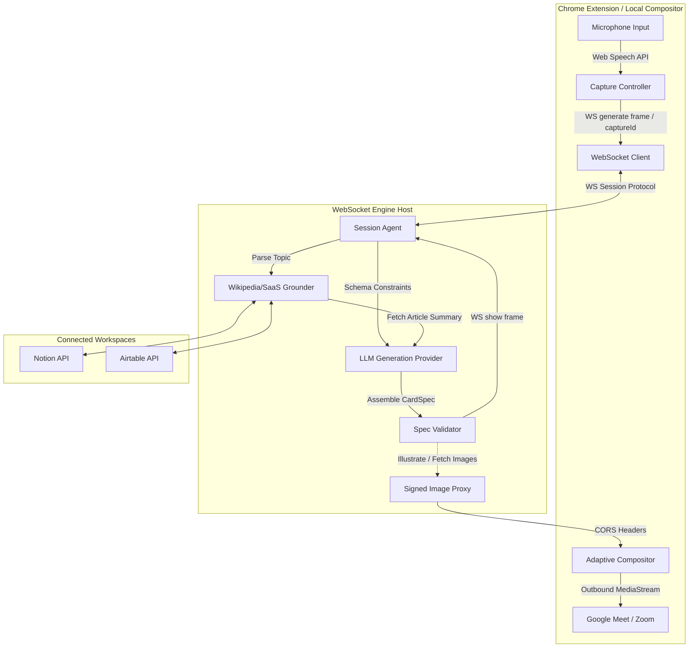
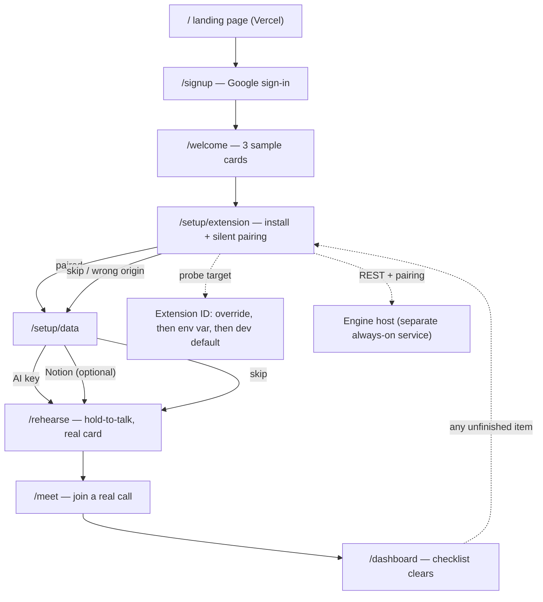
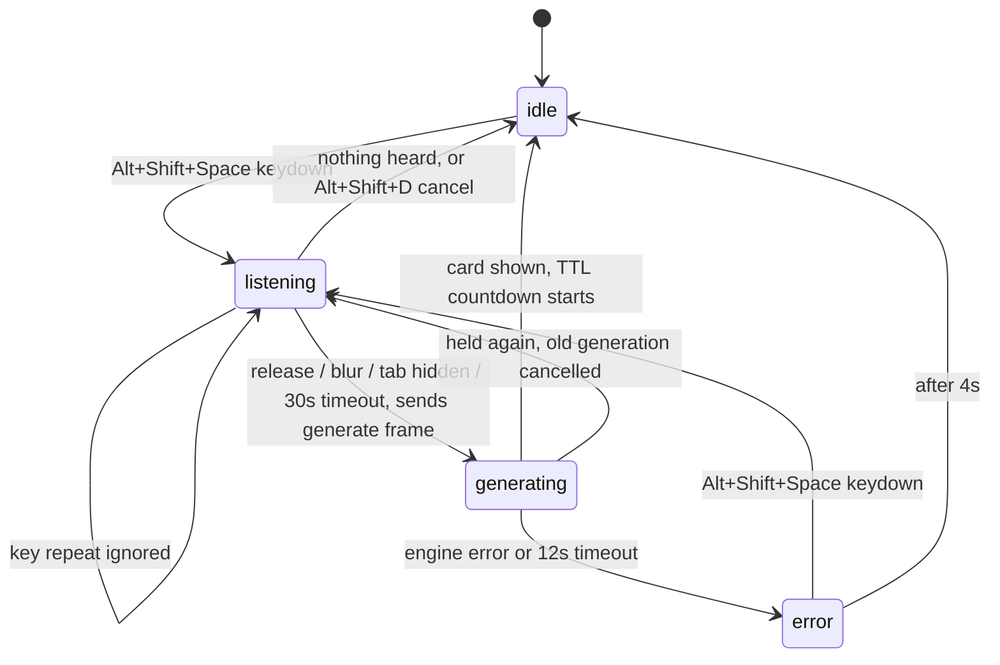

# Stash Live 🎛️
### The Ambient Broadcast Presenter Overlay Suite

```
      ___ _            _      _    _
     / __| |_ __ _ ___| |_   | |  (_)_ _____
     \__ \  _/ _` (_-< ' \   | |__| \ V / -_)
     |___/\__\__,_/__/_||_|  |____|_|\_/\___|
```

[](https://github.com/devcool20/meet-visualizer)
[](https://github.com/devcool20/meet-visualizer)
[](https://github.com/devcool20/meet-visualizer)
[](https://github.com/devcool20/meet-visualizer)

**Stash Live** is a zero-friction, cloud-integrated ambient broadcast engine that redefines executive presence and enterprise communication for the remote era. By shifting the video conferencing paradigm away from manual screen sharing, Stash Live introduces a unified workflow where spoken topics act as the **content generator**, automatically projecting visual overlays directly into the presenter's video stream.

Running as a SaaS integration platform, Stash Live connects with your existing B2B workspace hooks (Airtable, Notion, Google Drive, Salesforce) to inject context-aware, high-luminance glassmorphic data cards directly into the outbound webcam video feed.

---

## 🚀 Architectural Paradigm Shift

```
[ TRADITIONAL SCREEN SHARING ]
Presenter ──► Clicks "Share Screen" ──► Minimizes Windows ──► Face Shrinks ──► Engagement Drops

[ STASH LIVE STREAM ENGINE ]
Presenter ──► Speaks Naturally ──► Cloud Voice Parsing ──► SaaS Workspace Hook ──► Stream Overlay Ingestion
```

Traditional presentation workflows break critical communication loops: sharing a window shrinks the presenter's face into a tiny thumbnail, destroys direct eye contact, and stalls momentum while the host searches through desktop tabs.

Stash Live preserves human connection and authority by allowing presenters to remain full-sized on screen. Data assets glide into the video feed automatically based on spoken context, delivering real-time, in-the-moment value during high-stakes sales engineering pitches and executive corporate keynotes.

---

## 🛠️ High-Level Core Architecture

The system utilizes a secure cloud processing pipeline to map spoken phrases to authenticated B2B workspaces with minimal latency.



### Core Architecture Layers:
1. **Ingestion & Sync Layer**: Ingests the meeting stream audio feed to parse spoken vocabulary while maintaining active API hooks to connected SaaS platforms.
2. **Cloud Intent Recognition**: Real-time cloud speech-to-text model maps intent, entities, and anchoring keyphrases to corresponding document queries.
3. **State Orchestrator & Live Resolving**: Queries connected integrations (Airtable, Notion, Drive) to retrieve the latest data points. The dynamic asset is then built off-screen and animated smoothly into the video composition feed.

---

## 📅 Onboarding Journey & Interactive Checklist

Stash Live V1 provides a guided 5-step onboarding funnel that moves the user from initial sign-up to a working meeting with real overlays.



### The 5 Onboarding Steps:
1. **Welcome & Seeding**: Seeds the workspace with 3 sample cards.
2. **Extension Installation**: Tabbed setup for **Add to Chrome** (CWS Web Store listing) or **Load Unpacked** developer mode. Performs silent background pairing. See [`setup-screens-install-load-unpacked.html`](file:///C:/Users/sharm/OneDrive/Documents/personal-projects/stash-live/docs/plans/designs/setup-screens-install-load-unpacked.html).
3. **Data & AI Key Configuration**: Set up credentials (Gemini, OpenAI, Anthropic, or Notion) with on-the-spot validation.
4. **Rehearsal Loop**: Turns on webcam local preview, teaches hotkeys (`Alt+Shift+Space`), and processes real speech-to-card generation in an isolated test canvas.
5. **Meeting Launch**: Pre-flight checklist explaining permissions, camera interception rules, and troubleshooting tips.

---

## 🎙️ Trigger Modes & Hold-to-Talk State Machine

Stash Live supports two capture and triggering modes, ensuring that you only broadcast when you want to:

* **`hold-to-talk` (Default)**: The microphone is closed until the presenter holds the hotkey chord (`Alt+Shift+Space`). Releasing the chord flushes the speech transcript, mints a `captureId`, and sends a `generate` request to the AI generation engine.
* **`ambient` (Demo Mode)**: Continual background listening. Transcripts are forwarded as `transcript` frames and matched against predefined phrase fixtures (e.g., Notion pages). The hotkey chord is inert in this mode.



All communication protocol frames between the extension and the engine are typed in [`types.ts`](file:///C:/Users/sharm/OneDrive/Documents/personal-projects/stash-live/packages/card-spec/src/types.ts):
* `generate`: Client ➔ Engine request carrying text and `captureId`.
* `generating`: Engine ➔ Client status acknowledging receipt.
* `generate_failed`: Engine ➔ Client status with error details.

---

## 🎨 Design System & Visual Tokens

Adopted from **Premium Editorial Light Mode** guidelines, the system prioritizes whitespace, geometric rules, high contrast, and cinematic serif display marks. Refer to [`tokens.ts`](file:///C:/Users/sharm/OneDrive/Documents/personal-projects/stash-live/packages/card-core/src/tokens.ts) and [`design.md`](file:///C:/Users/sharm/OneDrive/Documents/personal-projects/stash-live/design.md).

* **Canvas Base Background**: `#FBF9F6` (Warm Alabaster / Antique Cream)
* **Primary Text & Solids**: `#1A1512` (Deep Espresso / Carbon Charcoal)
* **Muted Text**: `#4A4540` (retains a minimum of 4.19:1 contrast over dark glass and 8.24:1 over bright)
* **System Success Accent**: `#fb8500` (Orange for telemetry, active logs, and business telemetry)
* **Topic-Specific Accents**:
  * 🟣 Violet (`#6D28D9`): Used for People, Culture, and Biography cards.
  * 🟢 Teal (`#0F766E`): Used for Science, History, and Comparison cards.
* **Glass Containers Spec**:
  ```css
  .stash-glass-card {
    background: rgba(255, 255, 255, 0.62); /* Heightened from 0.45 for contrast legibility */
    backdrop-filter: blur(20px) saturate(120%);
    border: 1px solid rgba(26, 21, 18, 0.06);
    box-shadow: 0 8px 32px 0 rgba(26, 21, 18, 0.03);
  }
  ```

---

## 📋 Topic Recipes & Composition Laws

Stash Live dynamically maps the generated LLM content to one of seven rigid recipes based on topic domain to ensure clean visual layout and optimal readability over subsampled streams. See [`recipes.ts`](file:///C:/Users/sharm/OneDrive/Documents/personal-projects/stash-live/packages/card-core/src/recipes.ts) and the design plan details at [`design-plan-card-system.json`](file:///C:/Users/sharm/OneDrive/Documents/personal-projects/stash-live/docs/plans/designs/design-plan-card-system.json).

<details>
<summary><b>🔍 View 7 Topic Recipes</b></summary>

| Recipe Key | Title / Trigger Shape | Accent | Ordering & Block Composition | Special Constraints |
| :--- | :--- | :--- | :--- | :--- |
| `person_entity` | **Person / Entity** *(e.g. "Ranbir Kapoor")* | 🟣 Violet | `image` ➔ `text` ➔ `bullets` ➔ `status_list` | Image shown first when portrait resolves; fallback is a `metric_row` when image is absent. Max 3 bullets. |
| `concept_explainer` | **Concept Explainer** *(e.g. "what is RAG")* | 🟣 Violet | `text` ➔ `bullets` | Two-sentence definition, then 3 discriminating properties. No charts. |
| `business_metric` | **Business Metric** *(e.g. "our Q2 revenue")* | 🟠 Orange | `metric_row` ➔ `line_chart` ➔ `status_list` | Metric value must be ≤ 6 characters (e.g. `$240K` vs `$240,000` to avoid truncation). |
| `trend_history` | **Trend/History** *(e.g. "solar has tripled")* | 🟢 Teal | `metric_row` ➔ `bar_chart` ➔ `text` | `bar_chart` for discrete periods, `line_chart` for continuous. Labels limited to 3 points. |
| `comparison` | **Comparison/Trade-off** *(e.g. "Postgres vs Dynamo")* | 🟢 Teal | `metric_row` ➔ `status_list` ➔ `bullets` | `status_list` represents pros/cons using ok/warn/error dots. Row text is never colored. |
| `team_people` | **Team Roster** *(e.g. "who is on the team")* | 🟠 Orange | `metric_row` ➔ `avatar_grid` ➔ `status_list` | Maximum of 6 avatars per row. Overflow wraps to secondary row. |
| `list_facts` | **Enumerable Facts** *(e.g. "the 3 things we shipped")* | 🟠 Orange | `bullets` ➔ `text` | Enumerable bullets (3-5 items). Fallback when no quantitative data exists. |

</details>

<details>
<summary><b>📐 View 6 Core Composition Laws</b></summary>

1. **Accent is a Fill, Never a Caption**: Due to poor 4:2:0 subsampling, accent colors (like `#fb8500`) may only fill shape components (bars, bullets, circles) or large text (`≥ 20px`). Small captions must use `#1A1512` or `#4A4540`.
2. **Accents Locked to Topic Domain**: Keep palettes consistent using the three approved domain colors (Orange, Violet, Teal).
3. **Maximum Four-Block Limit**: To prevent the card from exceeding comfortable heights on the webcam viewport, the engine restricts specs to a maximum of 4 layout blocks. See [`layout.ts`](file:///C:/Users/sharm/OneDrive/Documents/personal-projects/stash-live/packages/card-core/src/layout.ts).
4. **No-Image Twin Fallback**: Canvas images fetch dynamically through the engine proxy. To prevent tainted canvas locks (`SecurityError`), cards must render successfully even if image fetching is skipped.
5. **Six-Glyph Metric Emphasis**: Numeric values in metric rows must fit in ~6 characters to prevent ellipsis truncation.
6. **Provenance Row Attribution**: Cards grounded on external sources (like Wikipedia) must include a single `status_list` item in `info` state stating the source and freshness.

</details>

---

## 🎛️ Adaptive Placement Engine

Over WebRTC streams, data cards should clear the presenter's silhouette to avoid occlusion. The compositor runs a lightweight luma-variance heuristic to identify the less active side of the stream. Refer to [`placement.ts`](file:///C:/Users/sharm/OneDrive/Documents/personal-projects/stash-live/packages/card-core/src/placement.ts).

```mermaid
flowchart LR
  Video["camera frame (1280x720)"] --> Down["downscale to 64x36 (reused canvas)"]
  Down --> Read["getImageData -> luma grid"]
  Read --> Score["score left + right rects: stdDev + 2 x edgeEnergy"]
  Score --> Sel{"SideSelector: EMA, margin 0.06, 3 samples, 4s cooldown"}
  Sel -->|"conclusive"| Side["chosen side"]
  Sel -->|"below 0.02 floor"| Fallback["fixed right (today's behavior)"]
  Side --> Spring["x spring (120/20)"]
  Fallback --> Spring
  Spring --> Draw["glass backdrop + cached raster"]
end
```

### Heuristics Formula
$$Score = \sigma(\text{Luma}) + 2 \cdot E_{\text{edge}}$$

Where $\sigma(\text{Luma})$ measures brightness variance, and $E_{\text{edge}}$ calculates local spatial edge frequencies (using high-pass filters). The side with the lower activity score is chosen.

### The 4 Stability Brakes

| Brake Mechanism | Setting / Threshold | Purpose |
| :--- | :--- | :--- |
| **Exponential Moving Average (EMA)** | $\alpha = 0.30$ | Smooths high-frequency camera noise and auto-exposure shifts. |
| **Hysteresis Margin** | $0.06$ | Opposing side must be significantly quieter before triggering a transition. |
| **Temporal Debouncing** | 3 consecutive samples (~480ms) | Prevents twitching on rapid movement. |
| **Switch Cooldown** | 4.0 seconds | Locks the card on the chosen side for a minimum duration. |

* **Inconclusive Backdrops**: If both sides score below the $0.02$ floor (e.g. background blur, solid gray clothing), the placement falls back to the **right third** of the screen.
* **Degradation Safety**: Downscaling and evaluation costs $\approx 0.13\text{ms}$ per frame. If the host system's performance degrades, the compositor's degradation ladder drops the scoring rate to half, and turns it off completely in high-blur or flat-fill states.

---

## ⚡ Compression-Aware Rendering (CAR) Engine

Virtual cameras and overlays degrade over WebRTC because platforms aggressively compress feeds using **4:2:0 Chroma Subsampling**, pixelating thin borders and small text. Stash Live combats this with two protocols:

* **Protocol A: High-Luminance Contrast Mapping**: Utilizes hardcoded high-luminance alpha channels (`rgba(255,255,255,0.62)`) and thin, high-contrast borders. Video encoders preserve these sharp brightness transitions, keeping cards legible.
* **Protocol B: Spatial Bitrate Optimization**: When cards remain static, the composition engine caps the coordinate zone's update rate, allowing the encoder to allocate bitrates to the presenter's camera feed.

---

## 🔐 Signed Image Proxy

Rendering third-party images onto the web-camera canvas risks taint blocks that lock `captureStream` with a `SecurityError`. Stash Live routes illustrations through a secure signed proxy:
1. The WebSocket engine resolves topic illustrations from Wikipedia.
2. The engine fetches image bytes, validates content-types/sizes, and signatures URLs.
3. The engine serves images from its own origin with strict CORS headers.
4. **The image is only written to the Spec if bytes are successfully held** — no blank slots or crashes.

---

## ⚙️ Environment Variables

<details>
<summary><b>🛠️ View Server & CLI Config (engine)</b></summary>

| Variable | Default | Description |
|---|---|---|
| `STASH_AI_PROVIDER` | `gemini` | Default provider when no user key (`gemini`, `openai`, `anthropic`) |
| `GEMINI_API_KEY` | — | Server-side Gemini API key (also powers embeddings + Tier 3) |
| `OPENAI_API_KEY` | — | Server-side OpenAI API key |
| `ANTHROPIC_API_KEY` | — | Server-side Anthropic API key |
| `STASH_AI_MODEL_GEMINI` | `gemini-flash-latest` | Gemini model override |
| `STASH_AI_MODEL_OPENAI` | `gpt-4.1-mini` | OpenAI model override |
| `STASH_AI_MODEL_ANTHROPIC` | `claude-sonnet-4-5` | Anthropic model override |
| `STASH_GROUNDING_LANG` | `en` | Wikipedia search language |

</details>

<details>
<summary><b>🖼️ View Proxy & Security Settings</b></summary>

| Variable | Default | Description |
|---|---|---|
| `STASH_IMAGE_PROXY_ORIGIN` | `STASH_PRODUCT_ORIGIN` | Public origin for proxied image URLs |
| `STASH_PRODUCT_ORIGIN` | `https://meet-visualizer.vercel.app` | Product origin used for CORS and image URLs |
| `STASH_ENCRYPTION_KEY` | — | 32-byte AES-256-GCM key (base64 or hex) for encrypting stored AI keys |

</details>

> [!TIP]
> **Local Dev Mode**: Running with `STASH_LOCAL=1` triggers simulated mocks for LLM generation, grounding, and image retrieval. No API keys or configurations are required.

---

## 💻 Development & Workspace CLI

Use standard commands from the project root to develop, test, or build:

```bash
# Install workspace dependencies & link packages
npm install

# Start local Vite development server
npm run dev

# Run all TypeScript typechecks across root, engine, and extension workspaces
npm run typecheck:all

# Run all test suites
npm run test:all

# Verify workspace (compilation, typechecking, tests, & build)
npm run verify
```