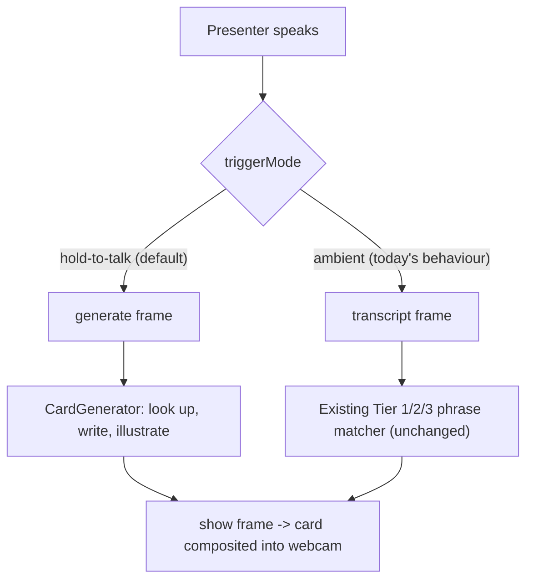

# AI-generated cards — plain-language summary

## What this changes

Today Stash Live can only show four hand-authored cards. It listens to your speech and tries to
match what you said against those four. That is the demo.

This slice adds a second, separate path: you **hold Alt+Shift+Space, say a sentence, and let go**,
and the engine writes a brand-new card about whatever you just said. You say "I have been a big
fan of Ranbir Kapoor" and a glass card appears in your outbound video — his name, a short
descriptor, two or three lines about him and his films, a photo, and a small line at the bottom
reading `Source: Wikipedia · Ranbir Kapoor`.

Nothing about the old path changes. The four sample cards, the phrase matching, the Notion sync,
and the offline dev mode all keep working exactly as they do now — they move behind a mode switch
(see below) rather than being replaced. The new path is additive: new message types on the
connection, new files in a new `engine/src/generation/` folder, and one new case in the connection
handler.

Only one branch is ever live at a time, which is what keeps a single sentence from doing both.

## Notion becomes optional

Right now the interesting content comes from Notion. After this, a user with no Notion at all can
paste an AI key (Gemini, OpenAI, or Anthropic) into dashboard Settings and everything works. The
key is encrypted with the same encryption helper the app already uses for Notion tokens, and the
dashboard never shows it back. If a user has no key, the server's own key is used. If neither
exists, the user gets a clear "add a key in Settings" message — not a crash.

## How the content is grounded

**The tradeoff.** Two honest options existed:

- Let the model write from memory. Fast, works for any topic, and confidently wrong sometimes with
  no way for anyone to tell.
- Look the topic up first, hand the model the real article text, and make it write from that.
  Slower by about a second, only covers topics that have an encyclopedia page, but every card can
  name where its facts came from.

**We chose the second.** The engine pulls the topic out of your sentence ("Ranbir Kapoor"),
searches Wikipedia, and gives the model the real summary text to work from. The bottom row of
every generated card names the source. When nothing useful is found, the model still writes a
card, but the bottom row says `Unverified · AI-generated` instead.

**Be clear about what this does and does not promise.** V1 guarantees the card is *derived from
and attributed to* a named source, or is *visibly marked unverified*. It does not guarantee the
facts are right. It is honest about its footing, not correct by construction. That is the right
V1 bar; fact-checking is a different product.

## Why the images are proxied through our own server

This is the part that looks like plumbing and is actually the highest-stakes decision in the
slice.

The card is drawn onto a canvas, and that canvas *becomes the user's webcam*. If an image loaded
from someone else's server without the right permission headers is drawn onto it, the browser
permanently locks the canvas — and the user's camera stops working for the rest of the call. The
existing renderer already defends against this by silently skipping such images, but that leaves
an ugly hole where the picture should be.

So the engine fetches the image itself, checks the type and size, keeps a copy in memory, and
serves it from our own address with the correct headers. Two further consequences:

- The card is only built with an image once the engine actually holds the bytes. No holes.
- Only two Wikimedia hosts are reachable, and the URLs are signed by the engine, so nobody can
  point the proxy at an arbitrary address.

## What it feels like in a meeting

You hold the key and talk. The moment you release, the badge says "Generating…". A few seconds
later the card slides in. If it fails — no key, no internet, model hiccup — the badge tells you
why and disappears; your camera and your call are untouched. Saying the same thing again in the
same meeting brings the card back instantly, because the result is cached for a day.

## Looks

The model does not get to pick colours. It picks one of six named accents and one of four layout
recipes, and the engine turns those into real colours from the existing design tokens. That is
what makes different topics look different without letting a model produce unreadable text: video
compression destroys coloured text, so accent colour is only ever used on things large enough to
survive it. The visual design agent owns the six colours and the four layout recipes; this plan
fixes the *shape* of that contract and freezes it. Working defaults ship with the first task so
nothing waits on design; design then replaces the values. If the design work needs a differently
shaped contract — a fifth layout, colour per block — that is a plan amendment, not a quiet edit,
because the model's allowed output is derived from this same shape.

## Deliberately left out of V1

- Generated cards are not saved to the dashboard library. They live for the meeting.
- No charts or graphs on generated cards. A made-up bar chart is the worst possible failure for
  something that looks like a data card. Charts stay fully supported for the existing cards.
- No fact-checking, no "are you sure?" step, no editing a card after it appears.
- No "that sounds close enough to what you said earlier" cache — only word-for-word repeats.
- No billing. Just a simple cap of 6 generations a minute and 40 an hour per person.

## The old always-on mode is kept, not replaced

Moving to hold-to-talk would have left the original always-listening phrase matcher alive but with
nothing feeding it. Rather than delete it, it becomes a **setting**: `triggerMode`, either
`hold-to-talk` (the new default) or `ambient` (exactly today's behaviour). One is active at a time
— in hold-to-talk the client only ever sends generate requests, in ambient it only ever sends
transcripts. That is what keeps the two paths from ever being live at once, in either mode.

Nothing in the old matcher changes. Same code, same tests, same four cards, same cooldown; it is
just only exercised in ambient mode. Users who already had settings saved before this field existed
are read as hold-to-talk, so no data migration is needed.

Flipping the switch takes effect **in the meeting, without reconnecting**. Today the app has no way
to push a settings change to a live connection at all — it only pushes card edits. This slice adds
the matching path for settings, so changing the mode mid-call immediately switches which way you
trigger a card.

## Messages and naming are settled

The three new messages between the extension and the engine are defined once, in this slice's
shared file: `generate` (client → engine), `generating`, and `generate_failed`, all keyed by a
`captureId`. The hold-to-talk slice uses them as-is rather than defining its own. The generate
request is deliberately its own message rather than a reuse of the existing transcript message —
that separation is what stops a held utterance from also triggering an old-style phrase match at the
same time.

## Cards clean themselves up

A card summoned by a momentary gesture must not sit on your video forever. Every generated card
carries an expiry (your existing auto-dismiss setting, 12 seconds by default). The in-meeting client
removes it when that elapses, and the engine independently sends a remove instruction shortly after
as a backstop, so a card cannot get stuck on screen even if the client's own timer never fires.

## Known risks

- **Speed.** Look-up plus model plus image is a few seconds. Acceptable for a hold-to-talk gesture,
  but it will feel long if the network is slow. The budget is capped at 8 seconds, after which you
  get a clean failure rather than a hang.
- **Wrong article.** Speech recognition mishears, the search picks the wrong page, and the card is
  about the wrong thing — but it names its source, so it is obvious rather than sneaky.
- **The CORS header on the image route is load-bearing.** If it is ever removed, cameras break. It
  is pinned by a test that asserts the exact header string.
