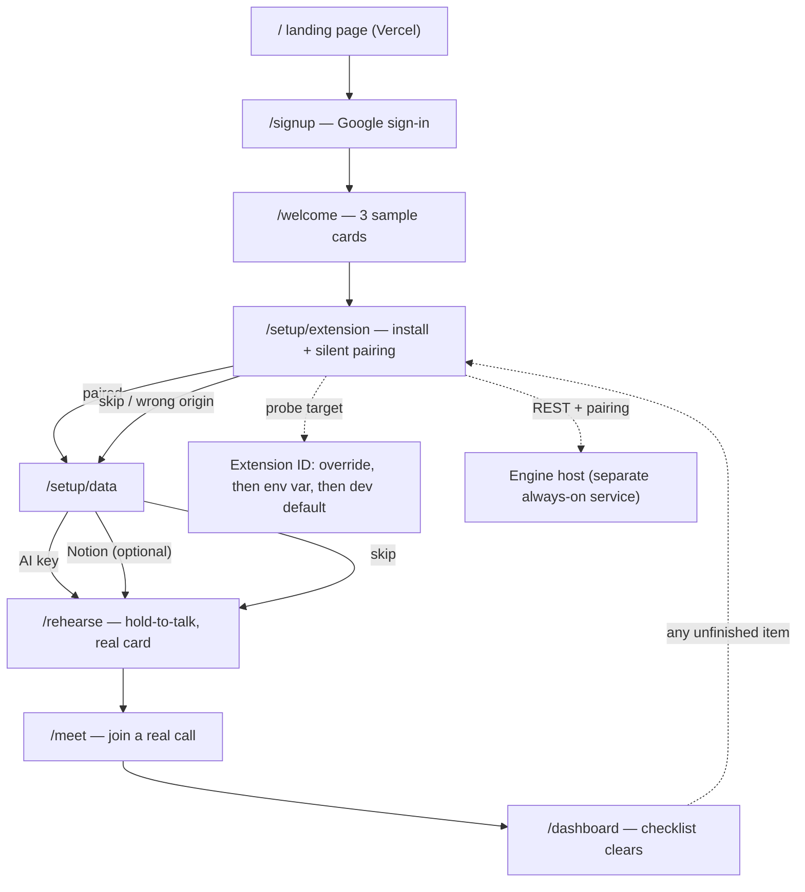
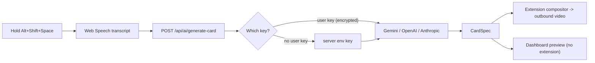

# Stash Live V1 — Dashboard & Setup Flow (summary)

## The problem

Today the dashboard is a convincing demo, not a product. Mock mode is on by default, the API
client returns empty arrays for anything not implemented, onboarding forces a Notion step in
the middle of the funnel, and the single most fragile moment — getting the Chrome extension
installed and paired — is one button that opens a Web Store listing that does not exist.
Rehearsal only shows fixture cards you tap. Nothing in the flow ever proves the thing works
in a real meeting.

## The journey we are building

1. **Land on the site, click "dashboard".** Signed out, you get one sign-in screen. Signed in,
   you go straight to wherever you left off.
2. **Welcome (1 of 5).** Three sample cards are seeded and shown, unchanged from today.
3. **Install the extension (2 of 5).** A dedicated screen instead of a banner buried in
   rehearsal. Both install paths are on it: **Add to Chrome** once the Web Store listing is
   live, and load-unpacked with numbered steps as the documented interim while review is
   pending. The page detects the extension and pairs itself silently. If you are on the wrong
   origin, or the engine host is not answering — the two most common ways this silently fails —
   the screen names the origin and tells you the fix.
4. **Give it something to say (3 of 5).** Two options, both optional individually: paste an AI
   key (Gemini, OpenAI or Anthropic) or connect Notion. Notion is no longer a step you have to
   walk past. The key is validated with a real call before we let you rely on it, and the key
   itself is never shown again.
5. **Rehearse (4 of 5).** Camera on, hold Alt+Shift+Space, say a sentence, and a card generated
   from what you actually said appears composited into your own video — the real pipeline, on
   your own face, before you risk it in front of anyone. Without the extension you still get a
   labelled preview so the funnel never dead-ends.
6. **The meeting (5 of 5).** A pre-join checklist, Chrome's permission prompt explained, and
   the awkward truth about camera interception stated plainly: no virtual camera device, keep
   your normal webcam, and if Meet grabbed the camera before Stash Live loaded, re-pick your
   camera in Meet's settings.

After that, the dashboard shows a setup checklist until every required item is genuinely done —
derived from live signals (is a device paired? is a key valid?), not from a remembered step.
Settings gains an AI-key panel and a trigger-mode choice, and states plainly that changes reach
a meeting you are already in without rejoining.

## Key decisions

**Notion becomes a branch, not a step.** The old `/notion-connect` page and every Notion
feature stay exactly where they are; they are just reached from an optional card inside one
"give it something to say" step. The step is satisfied by an AI key *or* Notion.

**A key or the server's key — both work.** If the deployment has its own provider key, you can
finish setup without pasting anything and the screen says so. Your own key takes precedence,
is encrypted server-side with the AES-256-GCM helper already used for Notion tokens, and is
only ever shown back as its last four characters.

**Setup status is measured, not remembered.** The persisted step is a resume hint. Whether the
extension is paired or a key is valid is checked live, so pairing from Settings or deleting a
key updates the checklist truthfully.

**The extension install is treated as the hard part.** It gets its own screen, an explicit
origin-mismatch diagnostic, a separate "the service isn't answering" diagnostic for the engine
host, an override for an extension with a different ID, live polling instead of a page reload,
and a skip that keeps the funnel moving.

**The extension ID is configuration, never a constant.** The Chrome Web Store re-signs the
package with its own key, so the published ID will not be the dev ID baked into the repo, and
nobody knows it until review clears. Publishing needs the user's own developer account, a fee,
and days of review — so V1 has to work before any of that happens. The pairing target resolves
from an in-page override, then a deploy-time env var, then the dev ID, and going live is an
env change plus a redeploy, not a code change.

**The engine moves to its own host.** Vercel only supports WebSockets inside functions with a
timeout-bound lifespan, so it cannot run a long-lived `ws` server. The dashboard stays on
Vercel; the engine goes to an always-on host. That makes the product origin and the engine
origin genuinely different, which the extension's manifest, the engine's CORS allowlist, and
the diagnostics on the install screen all have to agree about.

**Hold-to-talk is split, deliberately and narrowly.** The dashboard owns the Alt+Shift+Space
chord on `/rehearse`; the extension owns it inside Meet. That ships rehearsal without waiting
on the extension slice, and the divergence lives in exactly one hook. The hazard is written
down: the extension's content script already runs on the dashboard origin and starts speech
recognition unconditionally, so once it binds the same chord there will be two recognizers on
one page. The fix, when someone unifies it, is for the extension to stand down on the product
origin.

**Trigger mode is a user choice, not a migration.** Hold-to-talk is the default, but today's
continuous listening survives as "ambient", which matches your saved phrases instead of
generating new cards. The Settings toggle uses a radio group rather than a switch so it is
obvious only one runs at a time.

**AI cards are ephemeral by default.** A generated card answers one sentence; it is not a
reusable trigger. It shows immediately, sticks around in the session under "Recent AI cards",
and only enters the library — as a disabled draft, into the existing Review Drafts flow — if
you save it. That keeps the library meaningful, keeps transcript-derived text out of storage
by default (matching the existing snippets-off default), and preserves everything the Cards,
Editor, Drafts, Activity and Settings screens do today.

**The old step machine is left alone.** `src/lib/onboarding.ts` and its test keep working
untouched; the V1 funnel is a new module with a one-way migration of the stored value.

## Tradeoffs

- Rehearsal drives speech from the dashboard page rather than the extension. It ships without
  waiting on the extension slice, at the cost of two hold-to-talk implementations until they
  are unified.
- Mock mode gains session persistence so the demo does not lose its cards on reload. That is a
  deliberate divergence from "pure in-memory", opt-in and invisible to existing tests.
- The origin lock is documented, not removed. Making pairing work from arbitrary origins would
  mean weakening the exact-origin check that the extension's security model rests on.

## Not in V1

Billing, teams, SSO, quotas, provider fallback chains, key rotation, non-Chromium browsers,
Zoom/Teams, and any server-side storage of transcripts beyond the existing opt-in snippet
behaviour.

Two things are documentation deliverables rather than code, because a build agent cannot do
them: publishing the extension to the Chrome Web Store (developer account, one-time fee,
review period, then swapping in the store-assigned ID) and deploying the engine to its own
host (service setup, env vars, migrations, then repointing the dashboard and rebuilding the
extension). Both ship as step-by-step sections in `/docs`, each flagged as a manual operator
step.

## Risks worth naming

The extension can only pair from one exact origin. The engine is a long-lived WebSocket server
sharing a domain with a static Vite build, and if it is not actually reachable there, pairing
and live card push both fail. Camera interception only applies to `getUserMedia` calls made
after the extension loads, so a Meet tab opened first will not composite until it is reloaded
or the camera is re-selected — which is why that instruction is a first-class part of the last
screen rather than a footnote.

## Settled decisions

All three previously open questions are answered and folded in; §11 of the detailed plan
records them. Hold-to-talk: dashboard on `/rehearse`, extension in Meet, with the
duplicate-listener hazard documented. Distribution: Chrome Web Store, with the extension ID
made configuration and both install paths shipped. Engine hosting: a separate always-on host,
with the two-origin split reflected in the manifest, CORS, diagnostics, and docs.

## Boundaries with other slices

The AI-generation slice solely owns `packages/card-spec` for V1 — this slice imports the new
`generate` / `generating` / `generate_failed` frames and `UserSettings.triggerMode` and never
redeclares them. It also owns AI-key storage and the provider abstraction; this slice owns the
key-entry UX and the trigger-mode toggle UI. The dispatched design agent covers the card
system, the HUD states, and the in-video placeholders. It does not cover the new setup screens,
the checklist, or the provider and trigger-mode panels — this plan specifies their structure,
states, and copy intent only, using the existing tokens and design language, and leaves final
visuals to a second design pass.
