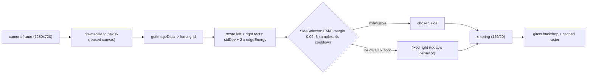
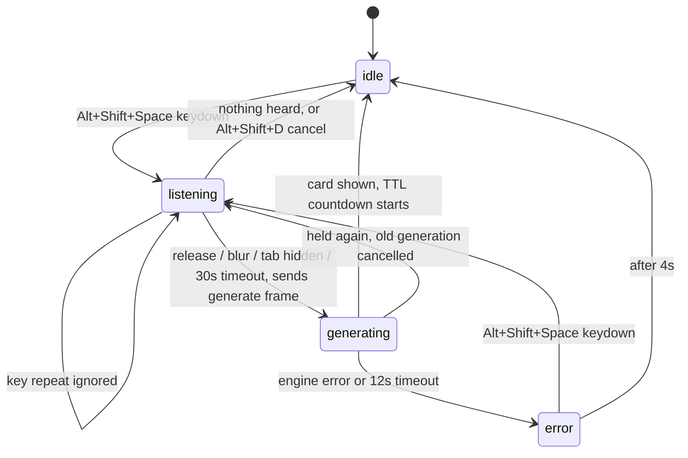

# Adaptive Placement + Hold-to-Talk — summary

## What this slice does

Two changes to make Stash Live actually usable in a real call:

1. **The card moves out of the presenter's way.** Today it is always pinned to the right third,
   regardless of where the presenter is sitting. This adds a cheap image heuristic that decides
   which side of the frame is quieter and puts the card there.
2. **The presenter controls when it listens.** Today speech recognition runs continuously the
   whole call. This adds a hold-to-talk mode — capture starts on keydown of Alt+Shift+Space, ends
   on keyup, and card generation fires immediately after — and makes it the V1 default. The
   existing always-on behavior is kept as the other setting, not removed.

Plus three supporting pieces those need: in-video "generating…" and error placeholders (because
generation takes seconds and a blank pause reads as broken), a presenter-only HUD with four states
(idle / listening / generating / error), and client-side honoring of `CardSpec.ttlMs` so generated
cards actually go away on their own — nothing in the codebase reads that field today.

Two ownership notes. The parallel AI-generation slice owns `packages/card-spec/src/types.ts` — the
`generate` / `generating` / `generate_failed` frames and the new `triggerMode` setting described
below; this slice specifies what it needs from that file, imports the types, and never edits it.
The design agent owns the visuals for all four HUD states and both placeholders,
including reduced-motion variants; this plan fixes the states, transitions, geometry, and wiring
and treats the mockups as the visual contract.

## How placement works

Every 160ms — about six times a second, not per frame — the compositor downscales the camera
frame to 64px wide into a canvas it allocates once and reuses, reads the pixels back, and scores
the two rectangles the card could occupy. The score is brightness variance plus twice the local
edge energy. A person produces strong edges; a wall does not. The quieter side wins.

That raw score is then run through four separate brakes so the card cannot twitch:
- an exponential moving average (alpha 0.30) smooths camera noise and auto-exposure hunting,
- the other side must be quieter by a real margin (0.06) before it is even a candidate,
- that has to hold for 3 consecutive samples (~480ms),
- and after any switch there is a 4-second cooldown.

If both sides score below a floor (0.02) — a flat backdrop, a virtual background, a dark room —
the signal is called inconclusive and the card stays exactly where today's code puts it: the right
side. When the side does change, the card's x springs across using the same spring already in the
codebase (stiffness 120, damping 20), so it glides instead of teleporting. Reduced motion snaps
instead. An explicit `Left`/`Right` in settings bypasses the heuristic entirely.

## How it fits the frame budget

Sampling costs roughly 0.8ms on the frames where it runs and nothing on the other ~94%, so about
0.13ms per frame amortized against a 33ms budget whose current draw target is 8ms. Crucially, the
sample happens inside `composite()`, so its cost is measured by the existing rolling-average
degradation ladder rather than hiding from it. The ladder now also throttles the sampler: full
speed at `full`, half rate at `fps24`, and sampling switches off entirely at `quarterBlur` and
`flatFill` with the side frozen where it was. A machine that is already struggling does not
additionally start moving the card around.

## How hold-to-talk works

The state diagram above describes hold-to-talk mode. On release the client mints a `captureId` and sends exactly one `generate` frame carrying the
utterance. That is deliberately a different frame from the existing `transcript` one: `transcript`
feeds the fixture-matching pipeline, `generate` goes straight to AI generation, and keeping them
disjoint is what stops a single spoken sentence from firing both at once and racing two cards into
the same slot.

Recognition is started and stopped per hold instead of running continuously. The existing
`WebSpeechProvider` and `RestartMachine` are kept as-is; the only provider change is letting
`stop()` flush a trailing final result instead of discarding it with `abort()`. Every awkward case
has a defined answer: key repeat is ignored, releasing Alt before Space still ends the hold,
window blur and tab-hide end it, a 30-second hard stop catches a lost keyup, releasing without
speaking submits nothing at all, and holding again while a card is still generating cancels the
old generation and starts fresh. Listeners run at capture phase with `preventDefault` so Meet
cannot swallow the chord. Alt+Shift+D and Alt+Shift+S keep working; D additionally cancels an
in-flight capture or generation.

## Two trigger modes, one of them live at a time

Nothing that works today is deleted. A new user setting, `triggerMode`, picks which capture path is
running:

- **`hold-to-talk`** — the V1 default. No microphone until the presenter holds the chord. Release
  sends `generate`. The always-on listener is not running.
- **`ambient`** — exactly what `main` does today. Continuous recognition, every final result
  forwarded as `transcript`, feeding the engine's existing Tier1/2/3 fixture matching. The Space
  chord is inert in this mode.

The two are never live at the same time. Switching modes goes through a single function that fully
tears down the current path before starting the other, so there is never a moment with two
recognizers running or two possible emitters for one sentence — which is what preserves the
disjoint-path guarantee that `generate` and `transcript` can never both fire from one utterance.
Alt+Shift+D (dismiss) and Alt+Shift+S (toggle HUD) stay bound in both modes.

The `startSpeech()` code is re-gated, not rewritten: its body and its `transcript` send are kept
byte-for-byte, and the only change is that it is now called conditionally instead of at mount. The
setting itself lives in `UserSettings` in `@stash/card-spec` and is added by the parallel
AI-generation slice, which owns that file; this plan specifies the exact name, the two values, and
the `hold-to-talk` default it depends on.

## Cards now expire on their own

`ttlMs` has been in the card contract from the start and has never been read by anything. Generated
cards depend on it, so this slice adds the countdown. It lives in the MAIN-world compositor next to
the animator — not the service worker, which Chrome can evict mid-countdown — and it is driven off
the render loop, so a backgrounded tab pauses rather than silently expiring a card the presenter
cannot see.

The precedence is: the card's own `ttlMs` wins; failing that the user's `autoDismissMs` setting;
failing that 12 seconds. The clock starts when the card is actually visible, not when the frame
arrived, so a card does not lose its animation time. A new card replaces the countdown outright
rather than stacking, and manual dismiss clears it — so dismissing at one second and waiting does
not produce a second phantom dismiss later. Placeholders never get a TTL; they are bounded by their
own generation timeout instead.

## Tradeoffs — where this will be wrong

**The heuristic has no idea what a person is.** It measures visual busyness. Concretely:

- A bookshelf, patterned curtain, or window with blinds behind the presenter will out-score the
  presenter, and the card will land on the presenter's face. This is the main failure mode and it
  is a real one.
- Meet's own background blur flattens the whole frame. Both sides drop below the signal floor, the
  heuristic goes inconclusive, and the feature silently does nothing — the card sits right, as
  today. Users who run background blur get no benefit from this work.
- A presenter wearing a plain shirt against a plain wall is nearly invisible to the score. Same
  inconclusive fallback.
- Because the brakes are deliberately strong, reacting to a genuine move takes roughly 800ms, and
  up to ~4.8s if a switch just happened. This is the price of not flickering, and flickering is
  much worse to watch.

The mitigations are that it degrades to today's known behavior rather than to something worse, it
is stable-wrong rather than twitchy-wrong, and the existing `Position: Left / Right` setting is a
one-click manual override. The user accepted the heuristic knowing this; face detection and any ML
model are explicitly out.

**Sampling reads back GPU pixels.** `getImageData` forces a pipeline flush. The estimate says it
is cheap at 64x36, but if it is not on some machine, the ladder measures it and degrades, which
turns sampling off. Any readback failure (including a tainted canvas) disables the sampler
permanently and falls back to fixed placement — it never retries inside the frame loop, because a
`SecurityError` escaping there costs the user their camera.

**Two tradeoffs that are not about placement.** Ambient fixture matching still works, but it is no
longer the default, so anyone who does not know the setting exists will experience the demo
behavior as having stopped. That is a discoverability cost, taken deliberately in exchange for a
microphone that is off until the presenter asks for it. And `ttlMs` goes from dead field to live
countdown in one step, so a too-short value chosen engine-side will show up for the first
time as cards vanishing too fast; the contract's own 1000ms floor is the only guard.

## Deliberately excluded from V1

- Face detection, person segmentation, any ML model, any new dependency.
- Moving the card vertically, shrinking it, or fading it when it does overlap. Two sides only.
- Corner/top/bottom placements.
- Sampling when no card is on screen, or on any per-frame cadence.
- A configurable hotkey or any hotkey settings UI.
- Re-recording, undo, transcript history, or queuing multiple in-flight generations.
- Persisting the chosen side across calls or sessions.
- Any edit to `packages/card-spec/` — the parallel slice owns the frame contract.
- Any UI for switching trigger mode. The setting is read from the existing config path; exposing
  it in the popup is another slice's work.
- Running both trigger modes at once, or mixing them per phrase.
- Server-side TTL enforcement, or preserving a card's remaining TTL across a reconnect.
- Any change to `computePlacement`'s existing signature or numbers, the degradation ladder's
  thresholds, or the four fixture cards. Placeholders are a separate draw path, not a `CardSpec`,
  precisely so the frozen contract stays frozen.

## Verifying it in a real call

Sit left of frame with a plain wall right — the card goes right and clears your head. Sit right —
it goes left. Sit centered with a symmetric background — it goes right and never moves. Slide
across the frame — it moves once, with a visible glide. Rock side to side — it does not move more
than once every four seconds. Set Position to Left — it is always left, whatever you do. Turn on
reduced motion — side changes are instant. Hold Alt+Shift+Space and the HUD says listening
immediately; release and the generating placeholder appears in the outbound video within about
400ms, replaced by the real card when it lands. Release without speaking and nothing happens at
all — no placeholder, no request. Then flip `triggerMode` to `ambient` and confirm today's behavior
is intact: recognition runs with no key held, saying a fixture phrase raises that fixture's card
just as it does on `main`, and the Space chord does nothing. Flip back and confirm the reverse. A card carrying an 8-second `ttlMs` disappears on its own about
8 seconds in; dismiss it manually first and it does not come back or fire a second dismiss when
the TTL would have elapsed. Throughout, a second participant must never see the HUD pill.

Worth flagging for whoever tests: Meet's self-view is mirrored and the outbound stream is not, so
"card on my left in self-view" means the card is on the right for everyone else. Check against a
second participant, not the preview.
